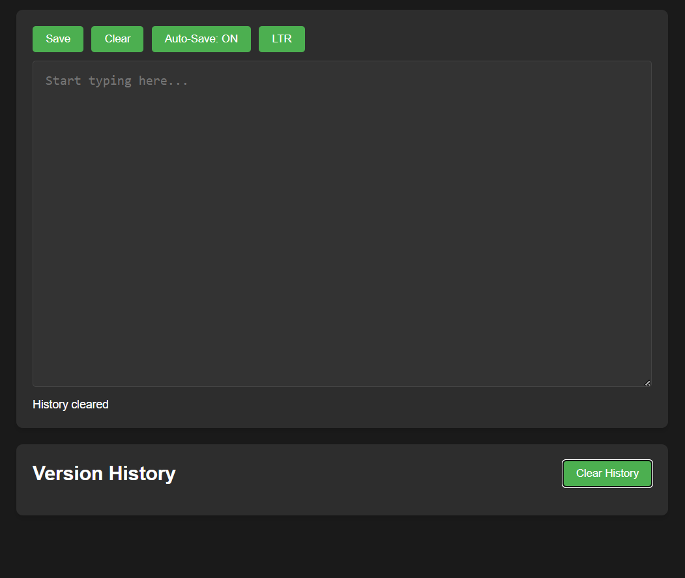

# Dark Mode Text Editor with Auto-Save & RTL Support

 <!-- Add a screenshot if available -->

A feature-rich dark mode text editor with auto-save functionality and automatic right-to-left (RTL) text direction detection for Arabic content.

## Features

- ✨ **Dark Mode Interface** - Easy on the eyes for long writing sessions
- ⚡ **Smart Auto-Save** - Saves automatically 4 seconds after you stop typing
- ↔️ **Automatic RTL Detection** - Switches to right-to-left mode when Arabic text is detected
- 🔄 **Manual Direction Toggle** - Switch between LTR/RTL modes manually
- 🕒 **Version History** - Keeps track of last 10 versions with timestamps
- 💾 **Local Storage** - All content persists between sessions
- 📱 **Responsive Design** - Works on both desktop and mobile devices

## How to Use

1. Simply start typing in the editor
2. For Arabic content, the editor will automatically switch to RTL mode
3. Use the toolbar buttons to:
   - **Save** - Manually save your document
   - **Clear** - Empty the editor (with confirmation)
   - **Auto-Save Toggle** - Turn auto-save on/off
   - **Direction Toggle** - Manually switch between LTR/RTL
4. Access previous versions in the Version History section

## Technical Details

- **Auto-save Delay**: 4 seconds after typing stops
- **Storage**: Uses browser's localStorage
- **History**: Maintains last 10 versions
- **Arabic Detection**: Uses Unicode range check for Arabic characters (\u0600-\u06FF)

## Installation

No installation required! Just open `index.html` in any modern browser.

For development:
1. Clone this repository
2. Open `index.html` in your browser

## Customization

You can easily customize:
- Auto-save delay time by changing `typingDelay` in the JavaScript
- Number of history versions kept by modifying the slice value
- Color scheme by editing the CSS variables

## Browser Support

Works in all modern browsers including:
- Chrome
- Firefox
- Safari
- Edge

## License

MIT License - Free to use and modify

---

**Enjoy writing!** ✍️
